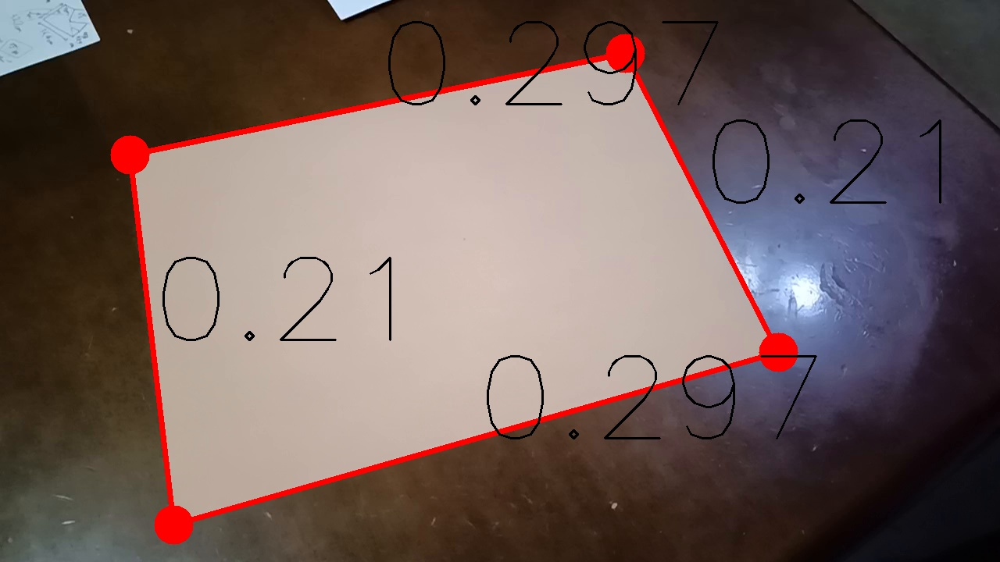

# Simple2DMapping
A simple application for 2d mapping from images. It contains tasks such as "Focal Length Estimation" & "Camera Pose Estimation", and is supposed to be applied to "Pedestrian Localization" tasks.
<!--     Isaya Andrés Inafuku, University of Tokyo, department of Civil Engineering -->

## Objective
The objective of this application is to provide a platform for 3d reconstrction from images taken with fixed cameras (relatively static). It is done following the next steps.

## Contents
### 1. __Focal length estimation__
Considering that the focal length is not always available in a needed unit, firstly we estimate it.
More precisely, in this part, we estimate the camera pose(Degree of Freedom: DoF=6) and the focal length(DoF=1), by applying 4 colinearity constraints, each of them providing 2 constraints.
- __Inputs__: 4 pairs of XYZ absolute orthogonal coordinates (arbitrary scale) and the corresponding uv image coordinates. For example, the 4 corners of a square can be a good choise of points. The size of the square can be given arbitrary. 
- __Medium__: Camera pose (X,Y,Z,$\omega$, $\phi$, $\kappa$) in the XYZ absolute orthogonal coordinate system of the given points.
- __Main output__: focal length $c$ of the camera, in pixel unit.
- __Assumptions__: 1. There is no center gap in the camera. In other words, the lens axis pass through the center of the image, thus $\Delta x=\Delta y=0$. 2. There are no lens distortions, either.
- __Things to be careful of__: The given points must not be on a single plane parallel to the image plane, or the focal length $c$ will not be determined.

#### Example of Focal length estimation
The picture below contains a A4-size paper(210mm x 297mm).

By providing the uv image coordinates of the 4 corners, we can calculate the focal length of the camera(e.g. 1036.39 pixels, where the size of the image is 1280 x 720).

### 2. __Camera Pose estimation__
Now that the focal length is obtained, we can effectuate a camera pose estimation of any picture taken with this camera. In this part, we obtain the Camera pose ($\omega$, $\phi$, $\kappa$) and the XYZ absolute coordinates of the reference points, relative to the camera, ny applying the 3 Colinearity conditions and restricting the absolute distance of 3 points.

- __Inputs__: uv image coordinates of 3 points making a triangle, and the distance between them in real scale(e.g. meter).
<!-- - __Medium__:  -->
- __Main output__: Camera pose ($\omega$, $\phi$, $\kappa$) and the 3d coordinates of the 3 reference points($\left( X_1, Y_1, Z_1=H\right)$, $\left( X_2=X_1, Y_2, Z_3=H\right)$, $\left( X_3, Y_3, Z_3=H\right)$)
- __Assumptions__: 1. All the interior orientation elements are known ($c$: given, $\Delta x=0.0$, $\Delta y=0.0$, $\Delta r_x=0.0$, $\Delta r_y=0.0$)
- __Things to be careful of__: define the triangle as big as possible to get a higher accuracy.

#### Example of Camera Pose estimation
The image below contains a triangle, with its side lengths known.

By applying this procedure, we get the camera pose and eventually, we can make an orthogonal image of the plane, containing the three reference points.
The image below was generated, using the mask image as well, to supprime the 3d objects on the table, like the thread roll and the lamp. 1 mm equals to 4 pixels.

You can see that the coins are rounded and the 500 yen coin measures around 106 pixels, which is equivalent to 26.5mm, the actual size of the coin, meaning that the dining table was correctly converted.

### 3. __3D point mapping__

now that the coordinate transformation can be done using the Rotation Matrix calculated above, the the XYZ coordinate of any point with the uv image coordinates and one of XYZ cordinates known. For example, when the height of an objects on the plane is known, we can calculate its XYZ coordinates, because its Z coordinate is the sum of plane's Z coordinate and the height.

#### Example of 3D point mapping
The image below contains two objects (a thread roll and a lamp), whose height is known (52mm and 170mm).

By applying the colinearity condition, the XY coordinates of the points can be calculated, considering it image coordinates and the given height.
The red points on the image below represents the x,y coordinates of the top-center of the thread roll and the lamp.

